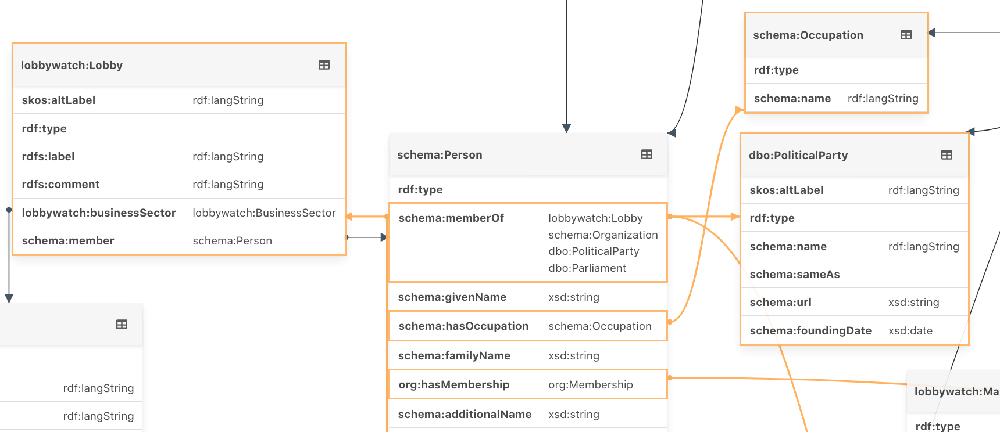

# SPEX - SPARQL Endpoint Explorer

SPEX is a tool designed to introspect data within SPARQL endpoints, leveraging the self-describing nature of RDF-based data to help users better understand its schema.

With the schema information available, you can use SPEX to browse instances of the data and follow links to other data points.

While SPEX is great for exploring and introspecting previously unknown datasets, it's not a generic graph-browser. Its primary goal is to provide insights into the schema and demonstrate basic data relationships. For more advanced graph exploration, consider using tools like [Graph Explorer](https://github.com/zazuko/graph-explorer).

## Usage

Try a [live instance of SPEX](https://spex.zazuko.com) to get started.

SPEX uses SPARQL to determine the available data. To begin, provide a SPARQL endpoint. Once configured, SPEX can introspect data from the default graph or a specific named graph. Use the named-graphs dropdown to narrow the scope if needed.

SPEX executes generic SPARQL queries to understand the data structure, grouping entities with the same class and querying distinct properties. It also examines property data types and their connections to other concepts.



Depending on the dataset size, introspection can be resource-intensive. To mitigate this, SPEX checks for available SHACL shapes on the endpoint/graph and uses them if found, instead of running a SPARQL query.

You can download the auto-generated shape as a starting point if you want to provide shapes on the endpoint.

## Limitations

Introspection and auto-generation of SHACL shapes might yield unexpected results in cases where:

* more than one class is assigned to instances of data
* multiple datasets have the same class but different properties

In such situations, providing pre-defined SHACL shapes is recommended. Inferring the correct structure automatically requires more effort than SPEX's generic queries.

The URL of the shape is a work in progress; see [this issue](https://github.com/zazuko/SPEX/issues/25) for more information.

SPEX attempts to find an optimal layout for rendering tables, but there's always room for improvement. Use your browser's zoom controls if the layout doesn't fit the page.

## Accessing an unencrypted (http) SPARQL endpoint

SPEX is a web application that runs in a browser window. This may cause issues if a SPARQL endpoint isn't available on https and SPEX is served on https only. Refer to [Mixed Content](https://developers.google.com/web/fundamentals/security/prevent-mixed-content/fixing-mixed-content) restrictions for more information.

A common error in this scenario is `TypeError: Network request failed` when trying to access an http SPARQL endpoint. The only exception is your local machine, where you'll always be able to access an http-only SPARQL endpoint on localhost.

To fix this, either implement a SPARQL proxy or serve SPEX on an http resource.
## SPEX as a local Application

SPEX can be installed as a so-called [progressive web application](https://en.wikipedia.org/wiki/Progressive_web_application)
(PWA). If you follow the [guide at MDN](https://developer.mozilla.org/en-US/docs/Web/Progressive_web_apps/Developer_guide/Installing),
SPEX will be available on your desktop computer like any other application.

## Extending SPEX

SPEX is developed by Zazuko and released as Open Source Software under
the [MIT license](LICENSE).

We use SPEX on a daily base to work with datasets. There are many ideas
of what could and should be added to SPEX. Check out the GitHub issues
to see what could be done next.

There are three ways to get new features implemented:

1. Implement it on your own and submit a pull-request to this repository.
2. Pay us for a specific feature. Get [in contact with us](mailto:info@zazuko.com?subject=SPEX) by email to get a quote.
3. Wait for 1 or 2 to happen.

## Support

Zazuko provides commercial support for SPEX, get in [contact with us](mailto:info@zazuko.com?subject=SPEX) for
more information.

## Development Project setup

```
npm install
```

### Compiles and hot-reloads for development
```
npm run serve
```

### Compiles and minifies for production
```
npm run build
```

### Run your unit tests
```
npm run test:unit
```

### Lints and fixes files
```
npm run lint
```

### Customize configuration
See [Configuration Reference](https://cli.vuejs.org/config/).
